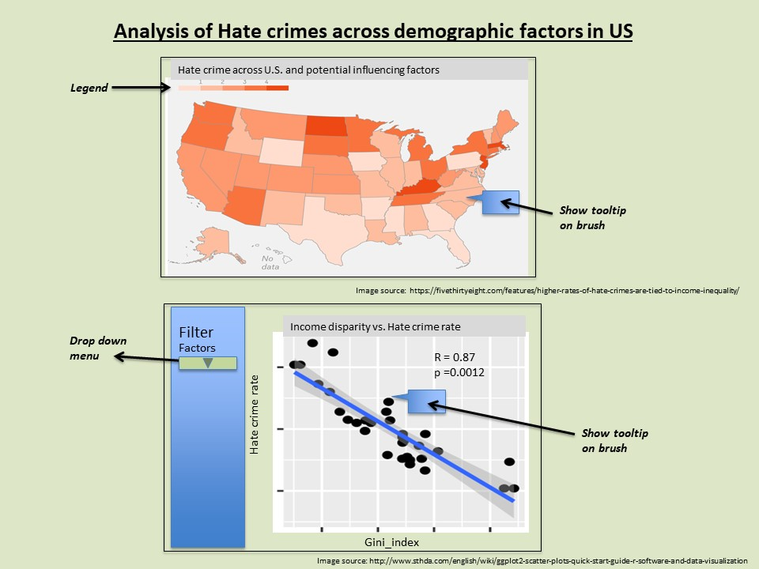
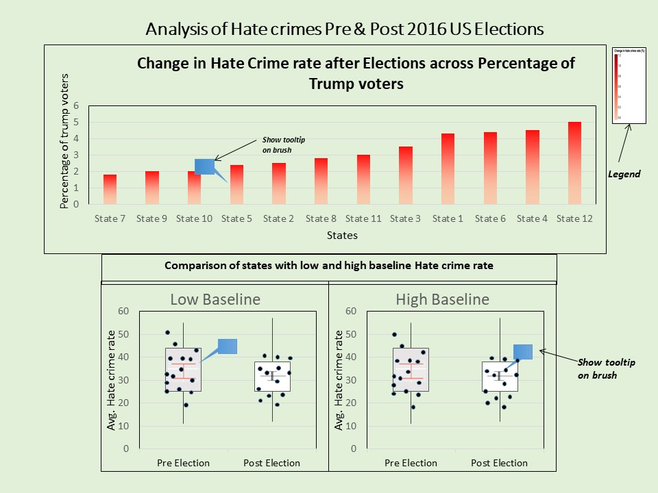

# DSCI_532_Group_103_L01 Dash App

## Team members 

* Saurav Chowdhury
* Sukriti Trehan
* Subing Cao

[Team Contract](https://github.ubc.ca/MDS-2019-20/DSCI_532_milestone1_saurav99/blob/master/Contract.md)

## Overview of the App

The app dashboard contains two tabs. The first tab has a choropleth map for visualization of the hate crime rate geospatially in the United States. Color is coded according to the average hate crime rate in each state. Users can hover over each state to check the values of hate crime rate and the potential influencing factors for each state. Further, a scatterplot shows the correlation between each potential factor and the hate crime rate with regression lines and statistics. From a dropdown list, users can select the type of factor they want to comapre with the hate crime rate. Alse the correlation between a certain factor and the hate crime rate can be seen on the plot. Users can also use the tooltip to check the values for each point which represent an US state in the plot. 

The seond tab of the dashboard shows a heatmap of all the states of the U.S. and the percentage of Trump voters in the 2016 presidential elections. The heatmap is color coded according to the change in hate crime rate across states within 10 days after the election. Users can use tooltip to check the rates of hate crime for pre and post elections. Users can also compare the change in hate crime rates for states segregated on the basis of low or high pre-election hate crime rates. To understand this graph more, users can use tooltip to get values for the hate crime rates.  

**Note** - *This app is build using Dash which supports code in Python and R.*
